<!-- ══════════════════ 一 · 法相 · 风雷翅 ══════════════════ -->

<!-- ══════════════════ 二 · 结婴异象 ══════════════════ -->

 

 

<samp>"Han Li never believed in fate. On the path of cultivation, every step must be steady.
There are no geniuses — only those who walk the path, step by step."</samp>

  

<samp>独立开发者 · 音频工具 / AI Agent / 本地知识库</samp>

  

## 修仙境界 · Cultivation Realms

| 境界 · Realm | 所修 · Domains | 道途 · State |
|:---:|:---|:---:|
| **筑基** · Foundation | `Python` `Java` `Shell` `SQL` | 已渡 · passed |
| **金丹** · Golden Core | `PyTorch` `PyQt5` `Demucs` `FFmpeg` | 已渡 · passed |
| **元婴** · Nascent Soul | `AI Agent` `Multi-Machine` `Obsidian RAG` | **当前 · current** |
| **化神** · Deity Transformation | *尚在推演 · brewing* | 闭关中 · sealed |

> 伪灵根结婴，异象为四象漩涡与九重天雷。
> 境界之上再无捷径——唯以时日换修为。

## 道行统计 · Cultivation Stats

## 正在炼丹 · Active Projects

| 项目 · Project | 简介 · What it does | 状态 · State |
|:---|:---|:---:|
| 🎵 [**conver2flac**](https://github.com/wshen-ai/conver2flac) | AI 人声分离 + 万能音频转换器 · Demucs + PyQt5 | 已出世 · live |
| 🤖 **Hermes AI Agent** | 多机智能助手 · 跨平台调度 · 知识库闭环 | 炼丹中 · cooking |
| 🛠️ **PyInstaller 踩坑录** | Windows DLL 冲突 · c10.dll · 打包工程化 | 载册中 · writing |

## 法器 · Toolbox

## 结交道友 · Connect

 

<samp>⚔️ 修仙无岁月，代码有乾坤 ⚔️</samp>

<samp>Time flows differently in cultivation — so does it in code.</samp>

